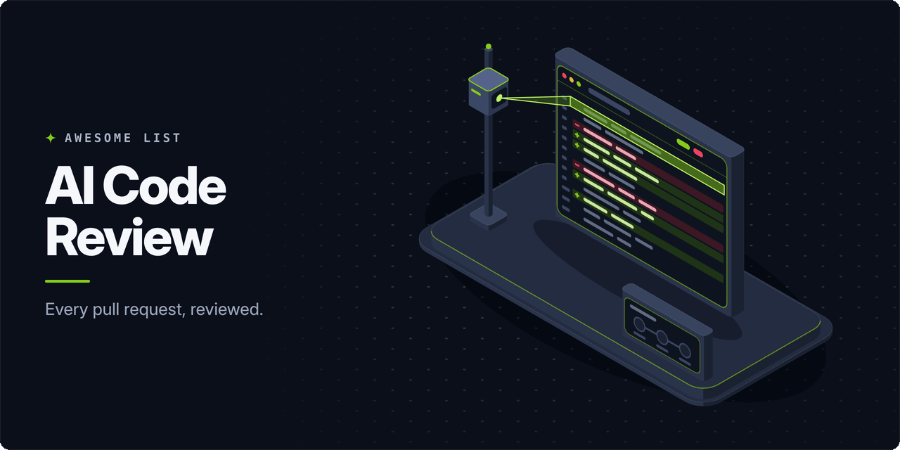

<!-- awesome:hero --><!-- /awesome:hero -->

<!-- awesome:title --><h1 align="center">Awesome AI Code Review</h1><!-- /awesome:title -->

<!-- awesome:tagline -->AI code review bots, review agents, security reviewers and the tooling that puts them in a pull request.<!-- /awesome:tagline -->

<!-- awesome:badges -->

  
  
  

<!-- /awesome:badges -->

AI code review puts a model in the reviewer's seat: it reads a code change, comments on bugs, security issues and style, and often proposes the fix. This list covers hosted and open-source review bots, the reviewers built into code hosts and agents, security reviewers, local and CI tooling, and the benchmarks and research that measure them.

## Contents

- [Review platforms](#review-platforms)
- [Built into code hosts and agents](#built-into-code-hosts-and-agents)
- [Open-source review bots](#open-source-review-bots)
- [GitHub Actions](#github-actions)
- [CLI and local review](#cli-and-local-review)
- [Security review](#security-review)
- [Agent skills, plugins and MCP servers](#agent-skills-plugins-and-mcp-servers)
- [Benchmarks and research](#benchmarks-and-research)
- [Related lists](#related-lists)
- [Contributing](#contributing)

## Review platforms

- [Aikido AI Code Review](https://www.aikido.dev/code/code-quality) - Aikido Security feature that reviews pull requests for bugs and code quality issues.
- [Augment Code Review](https://docs.augmentcode.com/codereview/overview) - Augment's GitHub reviewer that comments on pull requests using its codebase context engine.
- [Baz](https://baz.co) - Code review platform that comments on pull requests and walks reviewers through the change.
- [Bito AI Code Review Agent](https://bito.ai/product/ai-code-review-agent/) - Reviews GitHub, GitLab and Bitbucket pull requests with cross-repo dependency context.
- [Codacy AI Reviewer](https://www.codacy.com/ai-reviewer) - Pairs Codacy's static analysis with an LLM to flag logic, security and test gaps in each PR.
- [CodeRabbit](https://www.coderabbit.ai) - Reviews pull requests line by line, summarizes the change and answers questions in the thread.
- [cubic](https://www.cubic.dev) - PR reviewer that turns a team's past review comments into rules it checks on every change.
- [Cursor Bugbot](https://cursor.com/bugbot) - Cursor's pull request reviewer tuned to find logic bugs with few false positives.
- [DeepSource](https://deepsource.com) - Code review platform that runs static analysis and AI review on every pull request.
- [Devin Review](https://docs.devin.ai/work-with-devin/devin-review) - Cognition's tool for reading and reviewing large pull requests with Devin's help.
- [Gitar](https://www.sonarsource.com/products/gitar/) - Sonar's PR agent that reviews changes, diagnoses CI failures and pushes fixes.
- [Graphite AI Reviews](https://graphite.com/features/ai-reviews) - Graphite's reviewer that comments on GitHub pull requests inside its code review app.
- [Greptile](https://www.greptile.com) - Indexes the whole codebase and reviews pull requests with that context.
- [heygrc](https://heygrc.com) - Reviews pull requests for changes that put a compliance control such as SOC 2 at risk.
- [Korbit](https://www.korbit.ai) - Reviews GitHub and Bitbucket pull requests with context from the rest of the codebase.
- [Macroscope](https://macroscope.com) - Reviews pull requests for bugs and writes PR descriptions and team status updates.
- [Optibot](https://getoptimal.ai) - Reviews GitHub and GitLab pull requests with full codebase context and security scanning.
- [Qodo Git Plugin](https://www.qodo.ai/features/qodo-git/) - Qodo's review agent that comments on pull requests and drafts their descriptions.
- [Revieko](https://synqra.tech/revieko) - Flags repo-specific architecture drift in pull requests and points reviewers to the lines.
- [Sourcery](https://www.sourcery.ai) - Reviews GitHub and GitLab pull requests with bug findings, summaries and one-click fixes.
- [What The Diff](https://whatthediff.ai) - GitHub and GitLab app that explains the changes in a pull request in plain English.
- [Zenable](https://www.zenable.io) - Guardrails that check AI-written code against team rules in the IDE and on pull requests.

## Built into code hosts and agents

- [Amazon Q Developer code reviews](https://docs.aws.amazon.com/amazonq/latest/qdeveloper-ug/code-reviews.html) - Amazon Q feature that reviews code for quality and security issues and suggests fixes.
- [Claude Code Review](https://code.claude.com/docs/en/code-review) - Anthropic's managed PR review that runs several agents over the full codebase.
- [Codex code review](https://learn.chatgpt.com/docs/third-party/github) - OpenAI Codex reviews GitHub PRs on `@codex review`, following rules in AGENTS.md.
- [Gemini Code Assist on GitHub](https://docs.cloud.google.com/gemini/docs/code-review/review-repo-code) - GitHub app that has Gemini summarize and review pull requests.
- [GitHub Copilot code review](https://docs.github.com/en/copilot/concepts/agents/code-review) - Copilot reviews pull requests on GitHub and suggests fixes you can apply in place.
- [GitLab Duo Code Review](https://docs.gitlab.com/user/project/merge_requests/duo_in_merge_requests/) - GitLab Duo reviews a merge request when you request it as a reviewer.
- [Orbi](https://github.com/orbi-build/orbi) - Runs coding agents on GitHub issues; a separate review session must approve each PR before merge.
- [Windsurf PR Reviews](https://docs.devin.ai/desktop/windsurf-reviews/windsurf-reviews) - GitHub app that reviews pull requests, edits titles and leaves feedback as comments.

## Open-source review bots

- [AI Git Bot](https://github.com/tmseidel/ai-git-bot) - Self-hosted bot that reviews pull requests and runs other AI workflows on Git repositories.
- [AI Review](https://github.com/Nikita-Filonov/ai-review) - Reviews PRs on GitHub, GitLab, Bitbucket, Azure DevOps and Gitea with many LLM providers.
- [AsyncReview](https://github.com/AsyncFuncAI/AsyncReview) - Agentic PR reviewer that explores the repo and checks its findings in a sandbox.
- [ChatGPT-CodeReview](https://github.com/anc95/ChatGPT-CodeReview) - GitHub App and Action that reviews pull requests with OpenAI models.
- [Code-Review-GPT-Gitlab](https://github.com/mimo-x/Code-Review-GPT-Gitlab) - LLM review bot for GitLab merge requests that works with GPT, DeepSeek and others.
- [Codra](https://github.com/devarshishimpi/codra) - Self-hosted reviewer for GitHub pull requests that runs on Cloudflare Workers.
- [Gito](https://github.com/Nayjest/Gito) - Reviews GitHub and GitLab changes in CI or locally with any LLM, self-hosted ones included.
- [Kodus](https://github.com/kodustech/kodus-ai) - Self-hosted review agent with plain-language team rules and your own model keys.
- [Mira](https://github.com/miracodeai/mira) - Self-hosted reviewer with indexed PR reviews, walkthroughs, custom rules and vulnerability scans.
- [Nominal Code](https://github.com/gauthierdmn/nominal-code) - Posts inline reviews on GitHub and GitLab pull requests with any LLM provider.
- [Open Code Review (Alibaba)](https://github.com/alibaba/open-code-review) - Alibaba's reviewer that mixes rule pipelines with an LLM agent for line-level comments.
- [Open Code Review (spencermarx)](https://github.com/spencermarx/open-code-review) - Multi-agent reviewer that simulates a team of engineers discussing a change.
- [OpenReview](https://github.com/vercel-labs/openreview) - Vercel Labs' self-hosted review bot for GitHub pull requests.
- [PR Agent](https://github.com/The-PR-Agent/pr-agent) - Open-source PR reviewer with commands to review, describe, answer questions and suggest fixes.
- [PR-AF](https://github.com/Agent-Field/pr-af) - Plans a review per PR and spawns focused reviewer agents, built on AgentField.
- [Proval](https://github.com/seoes/proval) - Self-hosted review agent for GitLab, Forgejo and GitHub with local model support.
- [Reviewflow](https://github.com/DGouron/review-flow) - Webhook server that has Claude Code review GitLab MRs and GitHub PRs and follow up on fixes.
- [Sashiko](https://github.com/sashiko-dev/sashiko) - Agentic review of Linux kernel patches, run on a local checkout or a mailing list.
- [Serge](https://github.com/huggingface/serge) - Hugging Face's pull request reviewer that works with any OpenAI-compatible LLM.
- [Shippie](https://github.com/mattzcarey/shippie) - Extendable review and QA agent that runs in CI or from the terminal.
- [Warden](https://github.com/getsentry/warden) - Sentry's reviewer that runs agent skills on each PR or locally before you push.

## GitHub Actions

- [AI Code Reviewer (MoaKK)](https://github.com/MoaKK/AI-Code-Reviewer) - Action that reviews pull requests with the Claude API and posts inline comments and a summary.
- [Claude Code Action](https://github.com/anthropics/claude-code-action) - Runs Claude Code in GitHub workflows to review PRs and answer `@claude` mentions.
- [Codex Action](https://github.com/openai/codex-action) - Runs Codex in GitHub workflows, with a documented pull request review setup.
- [Gemini AI Code Reviewer](https://github.com/truongnh1992/gemini-ai-code-reviewer) - Action that reviews pull requests with Google's Gemini models.
- [GenAI Code Review](https://github.com/cirolini/genai-code-review) - Action that reviews pull request diffs with an LLM and posts the comments.
- [Juror](https://github.com/Juror-AI/juror) - Action that has several models review each PR and merges their findings into one report.
- [OpenRabbit](https://github.com/aryanbrite/openrabbit) - Pull request reviewer that runs entirely in GitHub Actions with no hosting.
- [run-gemini-cli](https://github.com/google-github-actions/run-gemini-cli) - Runs Gemini CLI in workflows, with ready-made pull request review and triage setups.
- [Z.ai Code Review](https://github.com/tarmojussila/zai-code-review) - Action that reviews pull requests with Z.ai models and comments on bugs.

## CLI and local review

- [Baz CLI](https://github.com/baz-scm/baz-cli) - Terminal tool that guides you through a review with AI notes on what matters.
- [Chorus](https://github.com/chorus-codes/chorus) - Has two or three different AI tools review a change and passes it only when they agree.
- [code-gate](https://github.com/Gil2015/code-gate) - Reviews Git commits with local Ollama models or cloud LLMs in an interactive CLI.
- [CodeGPT](https://github.com/appleboy/CodeGPT) - Go CLI that writes commit messages and short reviews of staged changes with LLMs.
- [CodeRabbit CLI](https://www.coderabbit.ai/cli) - Runs CodeRabbit reviews on local changes from the terminal.
- [Gentleman Guardian Angel](https://github.com/Gentleman-Programming/gentleman-guardian-angel) - Pre-commit hook that reviews staged files against your AGENTS.md with any AI provider.
- [Git AutoReview](https://gitautoreview.com) - VS Code extension that reviews GitHub, GitLab and Bitbucket PRs with several models.
- [git-lrc](https://github.com/HexmosTech/git-lrc) - Runs a short AI review of the change on every git commit.
- [inspect](https://github.com/Ataraxy-Labs/inspect) - Ranks the changed functions in a diff by structural risk so review starts where it matters.
- [OSS PR Reviewer](https://github.com/vuphongle/oss-pr-reviewer) - CLI that reviews GitHub PRs for bugs, security risks and missing tests in a Markdown report.
- [PR Cockpit](https://github.com/taovc/pr-cockpit) - Local workbench that runs Claude or Codex reviews in worktrees and holds comments for approval.
- [PR Lens](https://github.com/coldteadotai/pr-lens) - Draws each pull request as an architecture and data-flow walkthrough for the reviewer.
- [RedFlag](https://github.com/Addepar/RedFlag) - Flags high-risk code changes in CI or release batches and adds the right reviewers.
- [reviewd](https://github.com/simion/reviewd) - Reviews GitHub and Bitbucket PRs from the terminal through the Claude Code, Gemini and Codex CLIs.
- [roborev](https://github.com/kenn-io/roborev) - Reviews each commit in the background while coding agents work and feeds findings back.
- [Vet](https://github.com/imbue-ai/vet) - Checks code changes and agent conversations for bugs and goal drift, from CLI, skill or CI.

## Security review

- [agentgg](https://github.com/agentgg-dev/agentgg) - Agentic SAST that runs security agents over a whole repo or only a PR diff.
- [Claude Code Security Review](https://github.com/anthropics/claude-code-security-review) - Action that has Claude check pull request changes for security vulnerabilities.
- [Corgea](https://corgea.com) - AppSec platform that finds, triages and fixes vulnerabilities, including on pull requests.
- [DeepCode AI](https://snyk.io/platform/deepcode-ai/) - The AI engine behind Snyk Code that finds security flaws and proposes fixes.
- [DryRun Security](https://www.dryrun.security) - AI SAST that posts security findings on pull requests without hand-written rules.
- [Metis](https://github.com/arm/metis) - Arm's agentic framework for deep security review of source code.
- [Semgrep Multimodal](https://docs.semgrep.dev/semgrep-multimodal/overview) - Adds AI detection, triage and fix suggestions to Semgrep scans, on PRs included.
- [VulnHawk](https://github.com/momenbasel/vulnhawk) - AI SAST that looks for auth bypass, IDOR and logic bugs on each pull request.
- [ZeroPath](https://zeropath.com) - AI SAST that scans pull requests and repositories for vulnerabilities and logic flaws.

## Agent skills, plugins and MCP servers

- [Awesome Reviewers](https://github.com/baz-scm/awesome-reviewers) - Review instructions distilled from recurring reviewer feedback, ready to drop into an agent.
- [brooks-lint](https://github.com/hyhmrright/brooks-lint) - Agent skill that reviews code against decay risks drawn from twelve engineering books.
- [Claude Code code-review plugin](https://github.com/anthropics/claude-code/tree/main/plugins/code-review) - Runs parallel review agents on a PR and keeps only findings that score high confidence.
- [Claude Code PR Review Toolkit](https://github.com/anthropics/claude-code/tree/main/plugins/pr-review-toolkit) - Six review agents for comments, tests, error handling, types and simplification.
- [CodeRabbit Skills](https://github.com/coderabbitai/skills) - Skills and plugins that let coding agents run CodeRabbit reviews on local changes.
- [Greptile Skills](https://github.com/greptileai/skills) - Agent skills that run Greptile reviews, fix the comments and loop until the PR is clean.
- [Jev Review](https://github.com/NiazMorshed2007/jev-review) - Local MCP server that gives coding agents quality scores on the code they write.
- [Multi-MCP](https://github.com/religa/multi_mcp) - MCP server that runs code reviews and comparisons across several models for Claude Code.
- [Qodo Skills](https://github.com/qodo-ai/qodo-skills) - Qodo's agent skills for local review and for resolving PR review comments.

## Benchmarks and research

- [AACR-Bench](https://github.com/alibaba/aacr-bench) - Alibaba's multi-language benchmark for repository-level automated code review.
- [AI-Assisted Assessment of Coding Practices in Modern Code Review](https://arxiv.org/abs/2405.13565) - Google's AutoCommenter, an LLM that flags best-practice violations in review.
- [Automated Code Review In Practice](https://arxiv.org/abs/2412.18531) - Industry study of how LLM review tools affected pull requests at one company.
- [Automated Code Review Using Large Language Models at Ericsson](https://arxiv.org/abs/2507.19115) - Experience report on an LLM review tool paired with static analysis at Ericsson.
- [Automating Code Review Activities by Large-Scale Pre-training](https://arxiv.org/abs/2203.09095) - CodeReviewer, a model pre-trained on code changes and review comments.
- [BitsAI-CR](https://arxiv.org/abs/2501.15134) - ByteDance's two-stage LLM review system and its results in production.
- [Code Review Bench](https://github.com/withmartian/code-review-benchmark) - Martian's open benchmark of review tools, with datasets, judge prompts and a live board.
- [CodeReviewBench](https://www.codereviewbench.com/) - Scores models on the bugs human reviewers caught in real merged pull requests.
- [CRScore++](https://arxiv.org/abs/2506.00296) - Trains review comment generators with reinforcement learning on tool and AI feedback.
- [Prompting and Fine-tuning LLMs for Code Review Comments](https://arxiv.org/abs/2411.10129) - Compares prompting and QLoRA fine-tuning for writing review comments.
- [Resolving code review comments with ML](https://research.google/blog/resolving-code-review-comments-with-ml/) - Google Research post on a model that proposes edits for reviewer comments.
- [SWR-Bench](https://arxiv.org/abs/2509.01494) - Benchmark of 1,000 verified GitHub pull requests for LLM review comment generation.
- [Towards Practical Defect-Focused Automated Code Review](https://arxiv.org/abs/2505.17928) - Builds and deploys a defect-focused review pipeline on a large C++ codebase.

## Related lists

- [Awesome AI Code Reviews](https://github.com/kodustech/awesome-ai-code-review) - List of review agents, IDE assistants, papers and benchmarks from the Kodus team.
- [Awesome CodeRabbit](https://github.com/coderabbitai/awesome-coderabbit) - CodeRabbit's official list of starters and resources for its reviewer.

## Contributing

Contributions are welcome. Read the [contribution guidelines](contributing.md) first.

<!-- awesome:maintainer -->
Maintained by [Ian Wiedenman](https://github.com/ianwieds).
<!-- /awesome:maintainer -->
